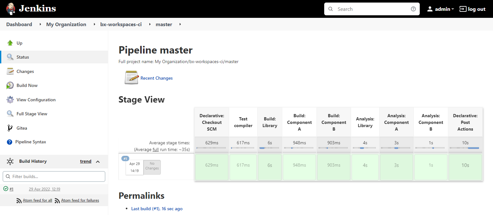
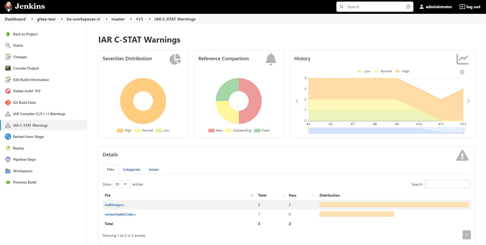
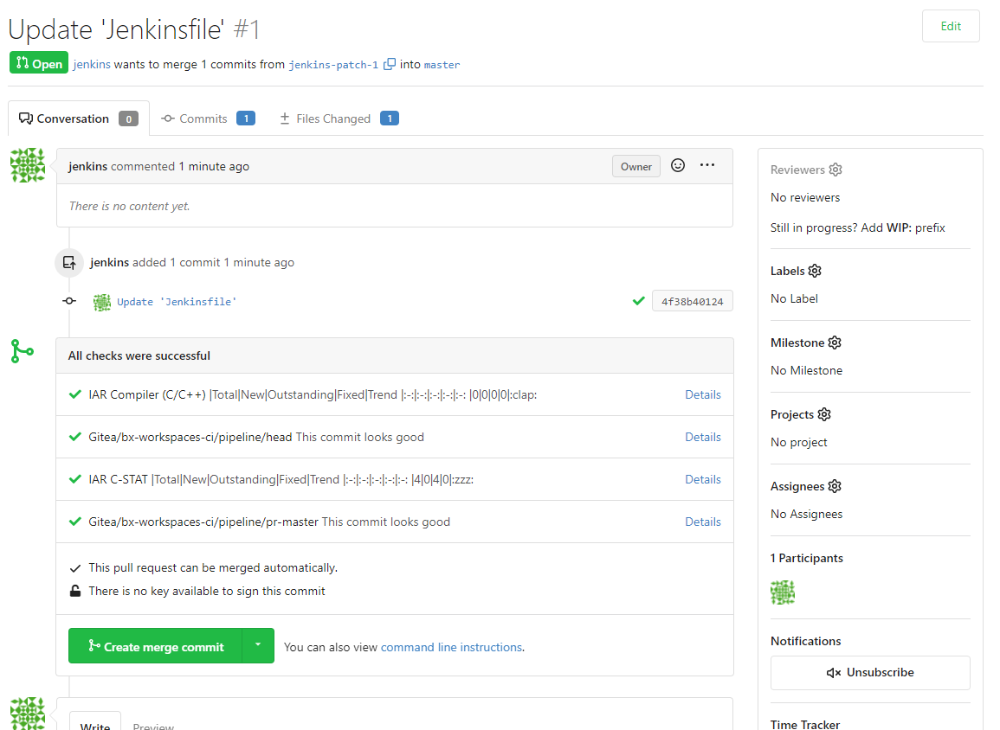

# Tutorial<br/>IAR Build Tools in a Jenkins CI

[Jenkins][url-jenkins] is an automation controller suitable for CI (Continuous Integration). [Gitea][url-gitea] is a lightweight Git server.

This tutorial provides a method for deploying a containerized setup for the [IAR Build Tools][url-iar-bx], Gitea and Jenkins, each one on its own container. 

The core objective is to quickly bootstrap an environment towards automated workflows for building and analyzing your embedded projects so that later you can customize it as you or your organization see fit.


## Disclaimer
The information in this repository is subject to change without notice and does not represent a commitment on any part of IAR Systems. While the information contained herein is assumed to be accurate, IAR Systems assumes no responsibility for any errors or omissions.


## Pre-requisites
For completing this tutorial you are going to need to have the [__bx-docker__][url-bx-docker] tutorial completed. 

You will also need a web browser to access webpages. For this tutorial we will consider that the web browser is installed on a Windows machine in which you have privileges to execute administrative tasks and that can reach the Linux machine containing the Docker daemon with the IAR Build Tools.

In the Linux machine shell, clone this repository to the user's home directory (`~`):
```
git clone https://github.com/iarsystems/bx-jenkins-ci.git ~/bx-jenkins-ci
```


## Setting up a Docker Network
In order to simplify our setup let's create a [docker network][url-docker-docs-net] and spawn all our containers on that network (defined with the `--network` parameter), so they can reach each other through their respective __network aliases__ (defined with the `--network-alias` parameter).

On the Linux machine shell, execute the following command to create the __jenkins__ network:
```
docker network create jenkins
```

Go to your Windows machine and, as Administrator, edit the __%WINDIR%/system32/drivers/etc/hosts__ file. Add the following line, replacing `192.168.1.2` by the Docker host's IP:
```
192.168.1.2 docker gitea jenkins
```

>:bulb: This step will allow you to, later on, access the containers running on the Linux machine from their respective hostnames and service ports.


## Setting up the IAR Build Tools
Now go back to the Linux machine shell to prepare the __jenkins-docker__ container.

It will use the official __docker:dind__ image. This image will allow us to run "Docker-in-Docker" so the Jenkins container will be able to access its docker images directly. This technique is easier to set up and it works as a secure [Docker Registry][url-docker-registry] for the Docker network we've just created.

On the Linux machine shell, execute the following command:
```
docker run --name jenkins-docker \
  --network jenkins --network-alias docker \
  --detach --restart unless-stopped --privileged \
  --env DOCKER_TLS_CERTDIR=/certs \
  --volume jenkins-docker-certs:/certs/client \
  --volume jenkins-data:/var/jenkins_home \
  --publish 3001:3001 --publish 2376:2376 \
  docker:dind --storage-driver overlay2 
```

Next we save the desired __iarsystems/bx\<package\>:\<version\>__ Docker image created with the [bx-docker][url-bx-docker] recipe to a compressed tape archive (`.tgz`):
```
docker save iarsystems/bx<package>:<version> | gzip > ~/bx.tgz
```

Move it to the __jenkins-docker__ container's root directory:
```
docker cp ~/bx.tgz jenkins-docker:/ && rm ~/bx.tgz 
```

Now load the image on the `jenkins-docker` container:
```
docker exec jenkins-docker docker load -i /bx.tgz
```

So that now the IAR Build Tools are available from the __jenkins-docker__ container:
```
docker exec jenkins-docker docker images iarsystems/*
```
For example:
>```
>REPOSITORY         TAG      IMAGE ID       CREATED         SIZE
>iarsystems/bxarm   9.20.4   adf216719d3b   5 minutes ago   2.45GB
>```

Remove the container's temporary __bx.tgz__ file:
```
docker exec jenkins-docker rm /bx.tgz 
```

### Setup the license
Enter into a __jenkins-docker__ container's interactive shell:
```
docker exec --interactive --tty jenkins-docker sh
```

Setup the license with `lightlicensemanager` from a disposable container using the IAR Build Tools image with the __\<package\>__, __\<version\>__ and __\<lms2-server-ip\>__ in use:
```
docker run --rm \
  --volume LMS2:/usr/local/etc/IARSystems \
  iarsystems/bx<package>:<version> \
  /opt/iarsystems/bx<package>/common/bin/lightlicensemanager setup -s <lms2-server-ip>
```

Exit the __jenkins-docker__ container:
```
exit
```

And finally commit the changes to the __jenkins-docker__ container:
```
docker commit jenkins-docker
```


## Setting up Gitea
Now it is the perfect time for us to set our __gitea__ container.

On the Linux machine, execute:
```
docker run --name gitea \
  --network jenkins --network-alias gitea \
  --detach --restart=unless-stopped \
  --volume gitea:/data \
  --volume /etc/timezone:/etc/timezone:ro \
  --volume /etc/localtime:/etc/localtime:ro \
  --publish 3000:3000 --publish 222:22 \
  gitea/gitea:1.16.6
```

### Initial setup
On the web browser, navigate to [http://gitea:3000](http://gitea:3000) to perform the initial setup.

Change __Server Domain__ to `gitea`

Change __Gitea Base URL__ to `http://gitea:3000`. 

Next click __Install Gitea__.

When running Gitea from a container, the first registered user will be the administrator. Register a new user (e.g. __jenkins__).

### Migrating a repository

On the top right corner of the page, go to __`+`__ → __New Migration__ → __GitHub__. 

Use the Gitea's migration form to migrate the [bx-workspaces-ci][url-bx-workspaces-ci] repository.

Edit the [Jenkinsfile](http://gitea:3000/jenkins/bx-workspaces-ci/_edit/master/Jenkinsfile) and update its Docker __image__ and __environment__ to match the ones in use.

### Generating an access token
For accessing the Gitea account from Jenkins we will not use the user credentials. Instead let's create a token.

In the user profile settings, go to __Application__ → __Generate New Token__. Choose a __Token Name__ (e.g. "Jenkins Token") and click on __Generate Token__.

>:bulb: Make sure to take note of the token shown. It will not be shown again.

### Allowing webhooks from the internal network
On the Linux machine shell, edit __app.ini__ using the [`vi`][url-vi] editor available in the __gitea__ container: 
```
docker exec -it gitea vi /data/gitea/conf/app.ini
```

Scroll down using <kbd>PGDN</kbd> and paste the following snippet to allow webhooks with the __jenkins__ container:
```
[webhook]
ALLOWED_HOST_LIST=jenkins
DISABLE_WEBHOOKS=false
```

Press <kbd>ESC</kbd>,  <kbd>:</kbd>, <kbd>w</kbd>, <kbd>q</kbd>, <kbd>ENTER</kbd> to __write__ to the file and __quit__.

Finally restart the __gitea__ container:
```
docker restart gitea
```


## Setting up Jenkins
Let's now set up the __jenkins__ container.

In general, the standard Jenkins setup has a number of steps and, given its fast-paced and complex ecosystem, it tends to break in terms of compatibility with many of its plugins on their bleeding edge versions. 

In order to reduce the chances of getting broken versions for this tutorial, let's use a custom [Dockerfile](Dockerfile) that will:
* use the __jenkins/jenkins:lts-jdk11__ as base image, which offers __LTS__ (Long-Term Support)
* use the [configuration-as-code][url-plugin-casc] plugin, so we get the initial Jenkins [configuration](jcasc.yaml) out-of-the-box
* use the `jenkins-plugin-cli` utility to automatically install a collection of [plugins](plugins.txt) 

Build the image, tagging it as __jenkins:jcasc__:
```
docker build --tag jenkins:jcasc ~/bx-jenkins-ci
```

Now run the __jenkins__ container:
>:bulb: Edit the `JENKINS_ADMIN_ID` and `JENKINS_ADMIN_PASSWORD` values if credentials other than `admin/password` are desired for the Jenkins' administrative user.
```
docker run --name jenkins \
  --network jenkins --network-alias jenkins \
  --detach --restart unless-stopped \
  --env JENKINS_ADMIN_ID=admin \
  --env JENKINS_ADMIN_PASSWORD=password \
  --env DOCKER_HOST=tcp://docker:2376 \
  --env DOCKER_CERT_PATH=/certs/client \
  --env DOCKER_TLS_VERIFY=1 \
  --publish 8080:8080 --publish 50000:50000 \
  --volume jenkins-data:/var/jenkins_home \
  --volume jenkins-docker-certs:/certs/client:ro \
  jenkins:jcasc
```

Lastly copy the `docker` client to the __jenkins__ container. It will be used by the [__docker-workflow__][url-plugin-docker-workflow] plugin later on:
```
docker cp jenkins-docker:/usr/local/bin/docker ~ \
  && docker cp ~/docker jenkins:/usr/local/bin \
  && rm ~/docker
```


### Setting up the Docker Cloud plugin
It is time to configure the [__docker-cloud__][url-plugin-docker-cloud] plugin.

Go to your web browser and navigate to [http://jenkins:8080](http://jenkins:8080).

Log in as __admin__.

Go to __Manage Jenkins__ → __Configure System__ → __Cloud__ → __a separate configuration page__.

Select __Add a new cloud__ → __Docker__.

Click on __Docker Cloud details...__.

Fill the __Docker Host URI__ field with the "network alias" (hostname) we defined for the __jenkins-docker__ container:
```
tcp://docker:2376
```
>:bulb: By default, the Docker daemon in the __jenkins-docker__ container listens to the `TCP/2376` port for TLS traffic.

Click on the __Add__ drop-down and create an __X.509 Client Certificate__.

When we started the __jenkins-docker__ container, server/client TLS certificates (and key) were automatically generated for us in the __jenkins-docker-certs__ volume which was mapped to the container's `/certs` directory. For enabling Jenkins to talk over TLS we will use those certificates which can be obtained with the following commands: 

__Client Key__:
```
docker exec jenkins-docker cat /certs/client/key.pem
```
__Client Certificate__:
```
docker exec jenkins-docker cat /certs/client/cert.pem
```
__Server CA Certificate__:
```
docker exec jenkins-docker cat /certs/server/ca.pem
```

After adding your Credential, select it from the __Server credentials__ drop-down list and then click on __Test Connection__. You should get an output similar to this:
>```
>Version = 20.10.14, API Version = 1.41
>```

Tick the __Enabled__ checkbox and, down below, click the __Save__ button.

### Setting up the Gitea plugin
In order to configure the [__gitea__][url-plugin-gitea] plugin, proceed as follows:
Go to __Manage Jenkins__ → __Configure System__ and scroll down to __Gitea Servers__.

__Add__ a new __Gitea server__ (e.g. "Gitea Server") with URL pointing to `http://gitea:3000`.

Enable the __Manage hooks__ checkbox. This will allow Jenkins to manage the [webhooks][url-gitea-docs-webhooks] for the Gitea server.

Select __Add__ next to the credentials dropdown and change its "Kind" to __Gitea Personal Access Token__.

Set the "Scope" to __Global__.

Paste the __Token__ that you took note during the Gitea server setup.

Give it a __Description__ (e.g. "Jenkins Token") and click __Add__.

Click __Save__.

>:bulb: Jenkins provides plugins for many other Git servers including Bitbucket, GitHub and GitLab. Although these services provide their own CI infrastructure. Gitea was chosen for this tutorial for its simplicity to deploy and use. Refer to [Managing Jenkins/Managing Plugins][url-jenkins-docs-plugins] for further details.

## Creating an Organization Folder
Now go to the Dashboard at [http://jenkins:8080](http://jenkins:8080).

On the main menu, click __New Item__.

Select __Organization Folder__, give it a name (e.g. "My organization") and click __Ok__.

Click on the __Projects__ tab and in __Repository Sources__, select __Gitea Organization__.

Select the "Jenkins Token" from the __Credentials__ drop-down list.

Fill the __Owner__ field with the username you created for your Gitea server.

Click __Save__.


## What happens next?
After that, Jenkins will use its multi-branch scan plugin to retrieve all the project repositories available on the Gitea Server.

When a project repository contains a [Jenkinsfile](https://github.com/IARSystems/bx-workspaces-ci/blob/master/Jenkinsfile) that uses a [declarative pipeline](https://www.jenkins.io/doc/book/pipeline/syntax/), Jenkins will then automatically execute the pipeline.

When the pipeline uses `agent { docker { image 'iarsystems/bx<package>:<version>' } } ...`, the __docker-cloud__ plugin will automatically use the required Docker image from the __jenkins-docker__ container.



Jenkins will get a push notification from Gitea (via webhooks) whenever a monitored event is generated on the __owner__'s repositories.

Now you can start developing using the [IAR Embedded Workbench][url-iar-ew] and committing the project's code to the Gitea Server so you get automated builds and reports.

### Highlights
* The [__warnings-ng__][url-plugin-warnings-ng] plugin can show compiler and static analyzer warnings for every build:



* The [__gitea-checks__][url-plugin-gitea-checks] plugin has integrations with the [__warnings-ng__][url-plugin-warnings-ng] plugin. On the Gitea server, it can help you to spot failing checks on pull requests, preventing potentially defective code from being inadvertently merged into a project's production branch:



## Issues
Found an issue or have a suggestion specifically related to the [__bx-jenkins-ci__][url-repo] tutorial? Feel free to use the public issue tracker.
- Do not forget to take a look at [earlier issues][url-repo-issue-old].
- If creating a [new][url-repo-issue-new] issue, please describe it in detail.


## Summary
There you have it. A quickly deployable and reproducible setup where everything runs on containers. And that was just one of many ways of setting automated workflows using the IAR Build Tools.

With [Jenkins Configuration as Code][url-jenkins-jcasc], setting up a new Jenkins controller can become a no-brainer event. Its whole configuration becomes as simple, human-friendly, plain text yaml syntax as it can be. Without any manual steps, this configuration can be validated and applied to a Jenkins controller in a fully reproducible way.
   
Now you can learn from the scripts, from the [Dockerfile](Dockerfile) and from the official [Jenkins Documentation][url-jenkins-docs] which together sum up as a cornerstone for your organization to use them as they are or to customize them so that the containers run in suitable ways for particular needs.

[Here][url-iar-bx] you can find additional resources such as on-demand webinars about the IAR Build Tools within automated workflows scenarios.


<!-- Links -->
[url-iar-bx]:                 https://iar.com/bx
[url-iar-contact]:            https://iar.com/about/contact
[url-iar-cstat]:              https://iar.com/cstat
[url-iar-ew]:                 https://iar.com/products/overview
[url-iar-fs]:                 https://iar.com/products/requirements/functional-safety
[url-iar-mp]:                 https://iar.com/mypages
[url-iar-lms2]:               https://links.iar.com/lms2-server

[url-vi]:                     https://en.wikipedia.org/wiki/Vi
    
[url-bx-docker]:              https://github.com/iarsystems/bx-docker
[url-bx-workspaces-ci]:       https://github.com/iarsystems/bx-workspaces-ci

[url-docker-registry]:        https://docs.docker.com/registry
[url-docker-docs-net]:        https://docs.docker.com/network
 
[url-gitea]:                  https://gitea.io
[url-gitea-docs-webhooks]:    https://docs.gitea.io/en-us/webhooks
 
[url-jenkins]:                https://www.jenkins.io
[url-jenkins-jcasc]:          https://www.jenkins.io/projects/jcasc
[url-jenkins-docs]:           https://www.jenkins.io/doc
[url-jenkins-docs-plugins]:   https://www.jenkins.io/doc/book/managing/plugins

[url-plugin-casc]:            https://plugins.jenkins.io/configuration-as-code
[url-plugin-docker-cloud]:    https://plugins.jenkins.io/docker-plugin
[url-plugin-docker-workflow]: https://plugins.jenkins.io/docker-workflow
[url-plugin-gitea]:           https://plugins.jenkins.io/gitea
[url-plugin-gitea-checks]:    https://plugins.jenkins.io/gitea-checks
[url-plugin-warnings-ng]:     https://plugins.jenkins.io/warnings-ng
 
[url-repo]:                   https://github.com/iarsystems/bx-jenkins-ci
[url-repo-wiki]:              https://github.com/iarsystems/bx-jenkins-ci/wiki
[url-repo-issue-new]:         https://github.com/iarsystems/bx-jenkins-ci/issues/new
[url-repo-issue-old]:         https://github.com/iarsystems/bx-jenkins-ci/issues?q=is%3Aissue+is%3Aopen%7Cclosed
