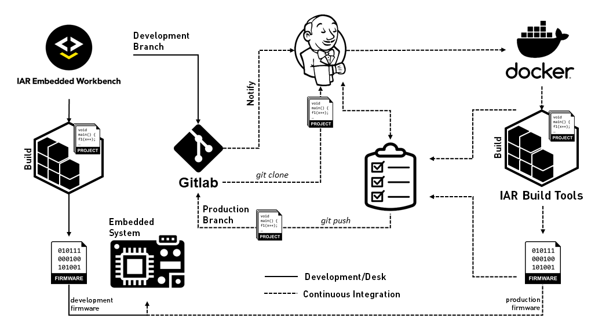

# Tutorial: IAR Build tools on Linux hosts with Jenkins

### Requirements
* [IAR BXARM Tools version v8.50.6+][iar-mypages-bxarm-url], downloadable from [IAR My Pages][iar-mypages-url]
* An Ubuntu v18.04+ amd64 Host
* A Stable Jenkins instance (tested with v2.251)
* A GitLab instance with a repository containing one IAR Embedded Workbench project (tested with v13.3.5)
* Familiarity with the involved tools

### Objectives
This tutorial provides an example with general setup guidelines on how a __Jenkins__-based pipeline can be configured for building projects with the [IAR Build tools on Linux hosts][iar-bx-url] in an automated continuous integration environment. 

It assumes that all the required tools 3rd party tools are already installed and all the instances are reachable within the in-premisses network.



If you have questions regarding this repository contents, you can start by checking its [__wiki__][repo-wiki-url] and then the [issue tracker][repo-old-issue-url] for the previously asked questions.
If it is a new question, feel free to post it [here][repo-new-issue-url].

### Table of Contents
* [Introduction](#introduction)
* [Install BXARM](#install-bxarm)
* [Prepare the project](#prepare-the-project)
* [Configure Jenkins and GitLab](#configure-jenkins-and-gitlab)
* [Build on push](#build-on-push)
* [Summary](#summary)

## Introduction
The proposed workflow divides the project repository in two branches: __development__ and __production__. 

By convention, developers should commit only on the _development_ branch. 
Every time a new commit is performed on the branch, GitLab [webhooks](https://docs.gitlab.com/ee/user/project/integrations/webhooks.html) will notify Jenkins about it.
Jenkins will clone the repository and perform a `Task` over it.
The Jenkins Task can be configured to build any IAR Embedded Workbench project using `iarbuild` from the BXARM build tools.
The Task also allows to script a set of conditions to be met.
Once the list of requirements are met, Jenkins commits the accepted project source files to the _production_ branch.
This process repeats continuously.

## Install BXARM
It is straightforward to install the BXARM build tools from the __.deb__ package:
```sh 
# Setup BXARM with dpkg 
$ sudo dpkg --install <path-to>/bxarm-8.50.6.deb

# Initialize the IAR License Manager on the Host
$ sudo /opt/iarsystems/bxarm/common/bin/lightlicensemanager init

# Setup the license on the Host
$ /opt/iarsystems/bxarm/common/bin/lightlicensemanager setup -s <IAR.License.Server.IP.address> 
```
> __Notes__:
> * Alternatively, it is possible to add the BXARM directories containing the executables on the search PATH, so they can be executed from anywhere. For example:
> ```sh
> # Append the following snippet to $HOME/.profile (or $HOME/.bashrc) script
>
> # If BXARM 8.50.6 is installed, set PATH so it includes its bin folders
> if [ -d "/opt/iarsystems/bxarm-8.50.6" ]; then
>   PATH="/opt/iarsystems/bxarm-8.50.6/arm/bin:/opt/iarsystems/bxarm-8.50.6/common/bin:$PATH"
> fi
> ```
> * Alternatively, it is possible to use the build tools directly from a Docker Container in a transparent manner. There is a [Tutorial: Docker images for IAR Build tools on Linux hosts][bxarm-docker-url]. And then there are [some extra guidelines](https://github.com/IARSystems/bxarm-jenkins/wiki/creating-a-bxarm-docker-image-for-jenkins) on how to prepare the __BXARM Docker image__ to run its containers from Jenkins.


## Prepare the project
From the development machine, prepare the local git repository for your project to commit on the _development_ branch

```sh
# If there is no production branch, create it
$ git branch production

# If there is no development branch, create it
$ git branch development

# Switch to the development branch
$ git checkout development
```

You can use the ready-made project available in this repository: [tests/c-stat](tests/c-stat).

## Configure GitLab and Jenkins

This section will show how GitLab and Jenkins could be configured. 

> __Note__: Equivalent CI Tools might be used for this scenario. If you choose to use another combination, please refer to their respective documentation. In that case, the instructions below might not apply.

### Initial settings on the GitLab instance 
On the GitLab User Settings page, perform the following changes:
1. Go to your _Profile Picture_, click it.
2. Select `Settings` → `Access Token`.
3. Enter with the token name and expiration date.
4. Check `api`.
5. Click `Create personal access token`.
6. Save the __Generated Token__ for later use.

### Initial settings on the Jenkins 
Once you have the Jenkins instance up and running, make sure you have the GitLab plugin installed.
1. Go to `Manage Jenkins` → `Manage Plugins`. 
2. Click `Available`tab.
3. Search for `GitLab Plugin` and install it.
4. Restart Jenkins.

### Setup the GitLab host in Jenkins
1. Go to `Manage Jenkins` → `Configure System`.
2. Configure the `GitLab` section as follows.
   * Check `Enable authentication for /project end-point`
   * Enter a name to `Connection name`
   * Enter your GitLab __"domain"__ for GitLab host URL
3. On  `Credential` click `Add` → `Jenkins` to generate credentials from Jenkins to GitLab.
4. Fill the popup dialog as follows
   * __Kind__: `GitLab API Token`
   * __API Token__: The [__Generated Token__](#initial-settings-on-the-gitLab-instance) you have previously saved for later use
   * __ID__: Fill as desired
   * __Information__: Fill as desired
5. Select the newly created credential.
6. Click `Test Connection` to verify.

### Setup the Jenkins Task to receive GitLab events
Assuming that you already have a _Freestyle Jenkins Task_ created, perform the following steps.
1. At `GitLab Connection`, select the GitLab profile created previously.
2. At `Source Code Management`, select `Git` and fill the fields as follows
   * Repositories
      * Repository URL: `ssh://<gitlab.server.ip:port>/<user>/<repository>.git`
   * Branches to build
      * Branch Specifier (blank if 'any'): `development`
   * Additional Behaviours, Merge before build
      * Name of repository: `origin`
      * Branch to merge to: `production`
      * Merge strategy: `default`
      * Fast-forward mode: `--ff`
      
3. At the `Build Trigger` section
   * Check `Build when a change is pushed to GitLab`
   * Copy the GitLab CI Service URL, where this URL will be used when GitLab wants to hook an event to Jenkins
   * Check `Push Event` for testing purposes
4. Click `Advanced`.
   * Generate __Secret Token__ and keep this new token as well
5. Click `Save`.

### Setup the build
Jenkins is very flexible when it comes to building projects. For this tutorial we will use the option of building an `.ewp` project with `iarbuild` by relying on a simple shell script. Jenkins will run the script to __build__ all the existing _Debug Configurations_ from the project(s) on its cloned repository. 

1. In the task configuration, navigate to the `Build` section.
2. Click on `Add build step`.
3. Select `Execute shell` and add the following snippet to the step:
```sh
#!/bin/bash

set -e

for i in $(find . -type f -name *.ewp); do
  iarbuild $i -build "*" -log all  -parallel 4    
  if [[ $? -ne 0 ]]; then 
    exit $?
  fi
done
```
4. Click `Save`.

5. In the task configuration, navigate to the `Post-build Actions`.
6. Click on `Add post-build action`.
7. Click on `Git Publisher`.
   * Check `Push Only If Build Succeeds`
   * Check `Merge Results`
8. Click `Save`.

### Setup GitLab Hook
On the `Project overview` in the GitLab instance, perform the following:
1. Go to `Settings` → `Integrations`.
2. Enter with the URL into the URL field.
3. Enter with the Secret from the [__Secret Token__](#setup-the-jenkins-task-to-receive-gitLab-events) field.
4. If Jenkins is running on HTTP, uncheck the `Enable SSL verification`.
5. Click `Add webhook`.
6. Once your Jenkins project was added to the list, click `Test` → `Push events`.

If everything worked as expected, you should get the message `Hook executed successfully: HTTP 200` at the top of the page.

## Build on push

If every component for this solution has been set up properly, you should be able to commit to the _development_ branch and check the build status on the _Jenkins Task Status_.
```sh
# Make sure you are on the development branch
$ git checkout development

# Perform the changes to the project and commit to the development branch in the local repository
$ git commit -m "<brief description of the changes>"

# Push the branch to the origin's development branch
$ git push origin development
```

## Summary

And that is how it can be done. Keep in mind that this mini tutorial is only intended to provide you with an example of a possible build server topology towards our [IAR Build Tools on Linux hosts][iar-bx-url] within Jenkins scenarios. It is definitely not a replacement for reading the documentation of the 3rd party involved tools.


[iar-bx-url]: https://www.iar.com/bx/
[iar-mypages-url]: https://iar.com/mypages/
[iar-mypages-bxarm-url]: http://supp.iar.com/MyPages/?product=BXARM
[iar-lms2-server-url]: http://links.iar.com/lms2-server
[fae-mail]: mailto:fae@iar.com?subject=Tell%20me%20more%20about%20bxarm-jenkins
[jenkins-url]: https://www.jenkins.io/
[jenkins-docs-url]: https://jenkins.io/doc/book/installing/#debianubuntu
[bxarm-docker-url]: https://github.com/IARSystems/bxarm-docker

[repo-wiki-url]: https://github.com/IARSystems/bxarm-jenkins/wiki
[repo-new-issue-url]: https://github.com/IARSystems/bxarm-jenkins/issues/new
[repo-old-issue-url]: https://github.com/IARSystems/bxarm-jenkins/issues?q=is%3Aissue+is%3Aopen%7Cclosed
