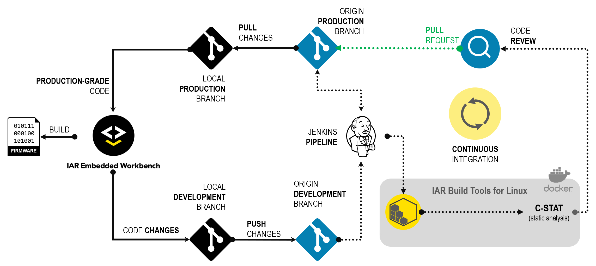

# Test the Jenkins CI pipeline <br/>using an IAR Embedded Workbench example project

Now it is time for the developer to start taking advantage of the Jenkins CI workflow. With a functional server, we can start exploring some of the Jenkins Pipeline capabilities. The Gitflow workflow is among the best practices for CI. It relies on a branching model when new features are introduced or fixes are under development. These feature branches containing the code changes usually go through a pipeline of verifications before being merged to the production branch. This methodology envisions preventing bugs from being introduced into the production code base.



## Required components
In this section of the tutorial, the following software components are going to be used on the development workstation:
* IAR Embedded Workbench for `<arch>` (i.e.: arm, riscv, rh850, rl78 or rx)
* A Git client (i.e.: [Ubuntu 20.04 LTS from Microsoft Store](https://www.microsoft.com/en-us/p/ubuntu-2004-lts/9n6svws3rx71), [Git for Windows](https://git-scm.com/download/win) or equivalent)

## Setup the development workstation
Configure `ssh` to use the _developer@workstation_ private key so it can authenticate to the Git server. Append the following to the __SSH__ configuration:
```
Host server
  Hostname <build-server-ip>
  User git
  IdentityFile ~/.ssh/id_ed25519_dev
  PreferredAuthentications publickey
```
>:warning: Update it with the correct `<build-server-ip>`.

>:warning: If needed, setup your [editor](setup.md#setup-your-editor).

Create a `ssh` keypair for the developer:
```
ssh-keygen -t ed25519 -C "developer@workstation" -f ~/.ssh/id_ed25519_dev
```
>```
>Generating public/private ed25519 key pair.
>Enter passphrase (empty for no passphrase): << Enter with a new password for the developer >>
>Enter same passphrase again: << Repeat the chosen password >>
>Your identification has been saved in /home/<developer>/.ssh/id_ed25519_dev
>Your public key has been saved in /home/<developer>/.ssh/id_ed25519_dev.pub
>The key fingerprint is:
>SHA256:Bs2WzSK5XN2+aXv1d3m09q1YbI9CBQ4bmClsPZQ developer@workstation
>The key's randomart image is:
>+--[ED25519 256]--+
>| .        =      |
>|  + E .   +      |
>| . . .= @ % +    |
>|     .    o      |
>|      o S * + .  |
>|       +    +    |
>|        o o o o  |
>|         .   .   |
>|    o.o   .oO    |
>+----[SHA256]-----+
>```

Provide the file `~/.ssh/id_ed25519_dev.pub` to the Gitolite server administrator  so he can [add the developer's key](setup.md#add-gitolite-users).

Once authorized, the developer should be able to test his Git server account: 
```
ssh git@server info
```
Expected output:
>```
>Enter passphrase for key '/home/<developer>/.ssh/id_ed25519_dev':
>hello developer, this is git@server running gitolite3 3.6.11-2 (Debian) on git 2.25.1
>
> R W    my-project
> R W    testing
>```
  
Clone the `my-project` repository to your Local Drive:
```
git clone git@server:my-project /mnt/c/my-project && cd /mnt/c/my-project
```

## Developing the project
Now the developer will start working on a new feature for the __componentB__:
```
git checkout -b dev-componentB
```

Go back to Windows and launch the IAR Embedded Workbench for `<arch>`.

Choose `File` > `Open Workspace...` and navigate to `C:\my-project\<arch>`. You will find a `workspace.eww` file. Go ahead and __open__ it.

This example workspace comes with three projects:
* library
* componentA
* componentB

Right-click on the __`library`__ project and choose `Make` (or <kbd>F7</kbd>). The `library` project should be built with no errors.
   - Now right-click on the `componentB` project and __Set as Active__.
   - Unfold the __`componentB`__ project tree and double click on its [componentB.c](../workspace/portable/componentB/componentB.c) file so it will open in the __Code Editor__.
   - Right-click on __`componentB`__ and choose `Make` (or <kbd>F7</kbd>). The `componentB` project should be built with __no__ errors.

### Changing the code for `componentB` project 

The __developer__ starts to work on the `dev-componentB` branch and, for example, the `DATATYPE` used in `componentB` had to change from `int32_t` to __`uint32_t`__ to hold values greater than `0x7FFF_FFFF`.

On the [componentB.c](../workspace/portable/componentB/componentB.c) file, right-click on the line with the __[`#include "library.h"`](../workspace/portable/componentB/componentB.c#L12)__ and choose __Open "library.h"__.

In the [library.h](../workspace/portable/library/library.h) file, find the line __[`#define DATATYPE int32_t`](../workspace/portable/library/library.h#L25)__ and replace it with
```c
#define DATATYPE uint32_t
```
  
Rebuild the `library` project using right-click on `library` and choose `Make` (or <kbd>F7</kbd>). It should build with __no errors__.

Rebuild the `componentB` project using right-click on `componentB` and choose `Make` (or <kbd>F7</kbd>). It should build with __no errors__.

### Commit the changes
Go back to the Git Bash terminal.

Commit to the changes to the tracked files in the cloned `my-project` repository:
```
git commit --all --message "Improvement proposal for componentB"
```

The expected output is similar to this, but with a different commit hash:
>```
>[dev-componentB 098cc4c] Improvement proposal for componentB
>  1 file changed, 1 insertion(+), 1 deletion(-)
>```

Finally publish these changes with `git push`, so the code changes go back to the `origin` repository:
```
git push --set-upstream origin dev-componentB
```

Push output example:
>```
>Enter passphrase for key '/home/<developer>/.ssh/id_ed25519_dev': << Enter with the SSH developer's password >>
>Enumerating objects: 9, done.
>Counting objects: 100% (9/9), done.
>Delta compression using up to 8 threads
>Compressing objects: 100% (5/5), done.
>Writing objects: 100% (5/5), 1.06 KiB | 1.06 MiB/s, done.
>Total 5 (delta 4), reused 0 (delta 0)
>To server:my-project.git
> * [new branch]      dev-componentB -> dev-componentB
>Branch 'dev-componentB' set up to track remote branch 'dev-componentB' from 'origin'.
>```


## Jenkins Build
Going back to Jenkins we will see in the `Status` that a new branch named `dev-componentB` has been automatically detected and the pipeline has been executed.

Although the changes that we performed on the __componentB__ project affected the __library__ which was also used by the __componentA__, which we did not notice while performing the changes in the __componentB__ from IDE. Now imagine this tug-of-war for a bigger project with dozens of components using shared resources.
  
This event shows the benefit of using a DevOps pipeline when developing bigger projects, where there are dependencies and multiple actors. This practice helps development teams in organizations to spot issues in the broader spectrum faster, while delivering better results in the long run.
 
The failed pipeline gives the opportunity for both __Project Managers__ and __Developers__ to discuss alternative approaches to fix one issue without creating others which would be, otherwise, discovered probably later on.
  
Ultimately, the pipeline builds a development log of the project which, when properly used, can become a solid asset for consistent deliveries as the project evolves.

>:warning: The __library__ project was deliberadely crafted without following the good practice of [single-responsibility principle (SRP)](https://en.wikipedia.org/wiki/Single-responsibility_principle), especially for the purpose of this demonstration.

## Summary
In short, in this tutorial we went through one of the many ways that the [IAR Build Tools for Linux](https://iar.com/bx) can be used in CI scenarios. 
