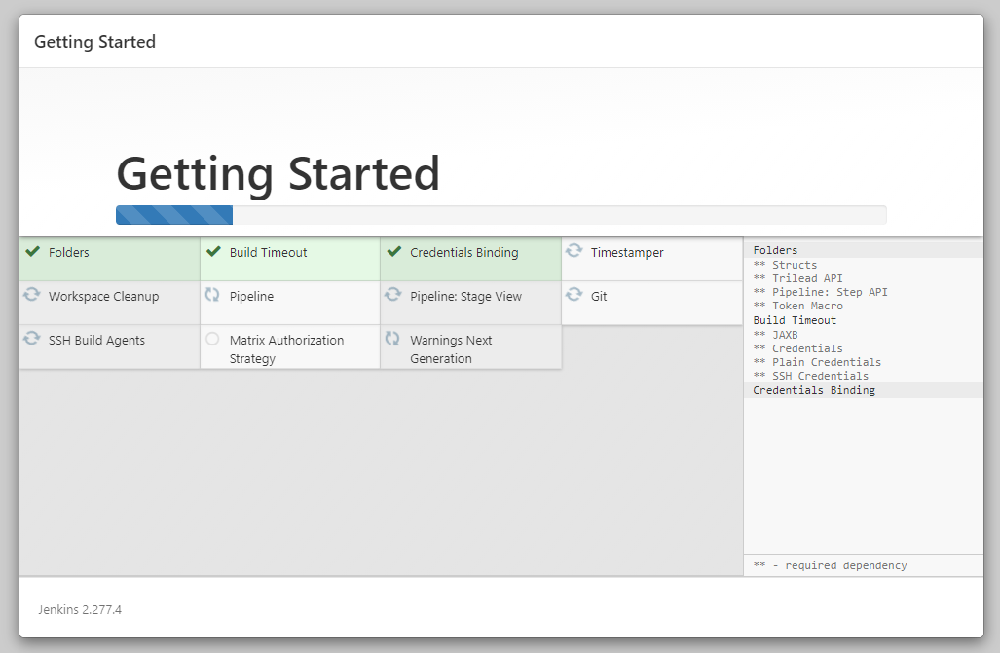
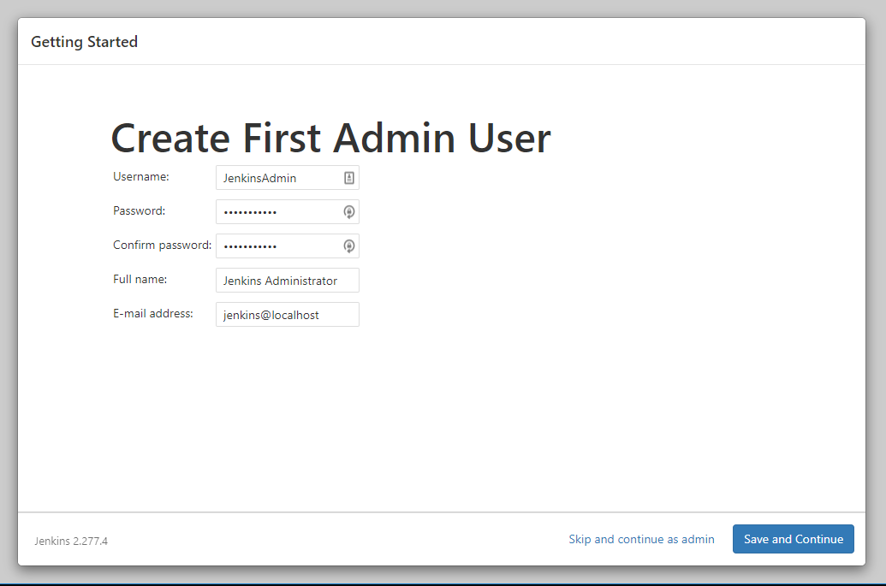
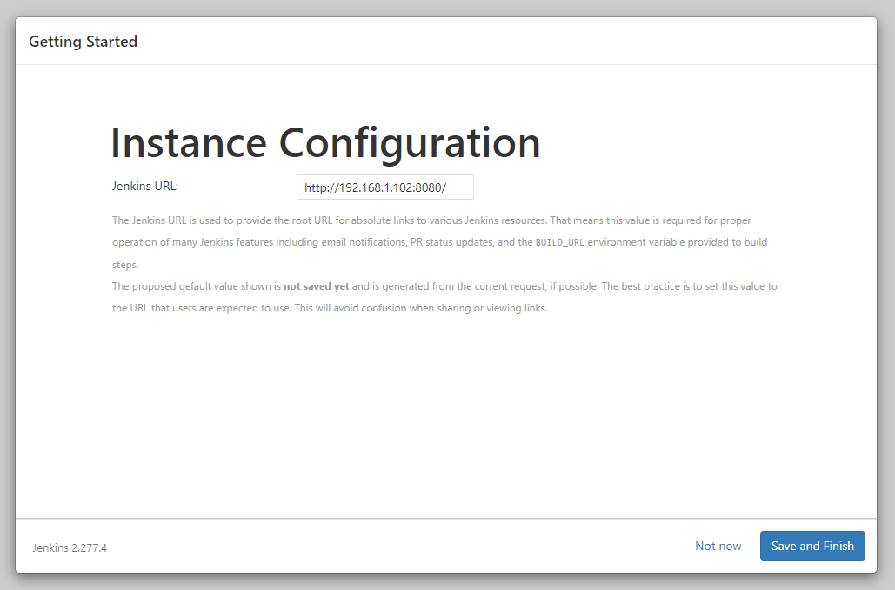
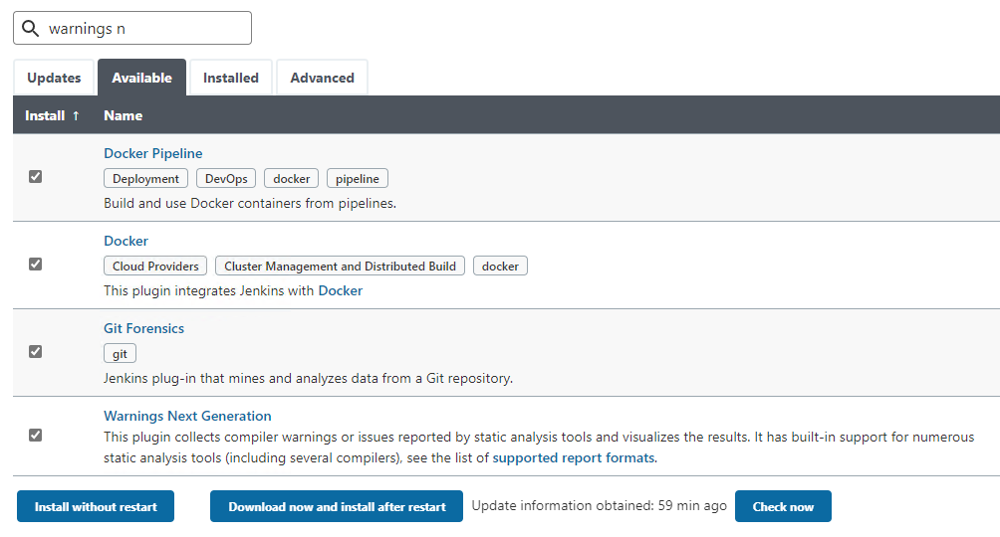
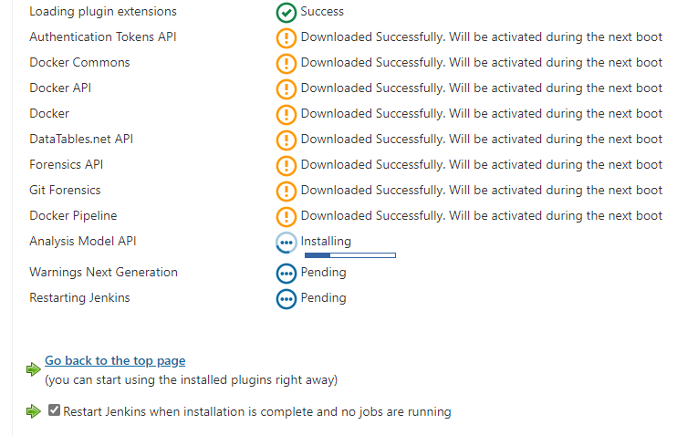
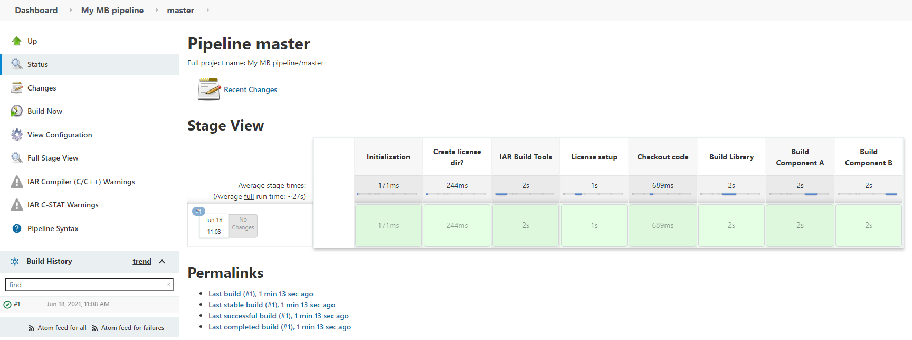
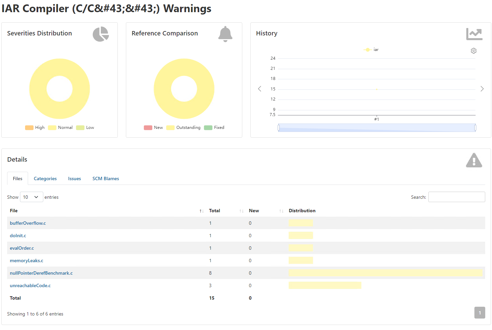
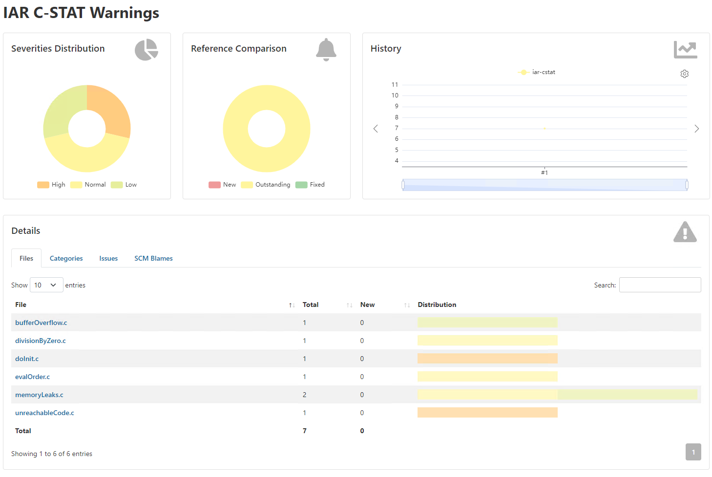

# Setup the Jenkins CI build server
The following software, alongside their respective dependencies, are going to be used in the __build server__. The mentioned versions were the ones available when this tutorial was created.
* [Ubuntu](https://ubuntu.com) amd64 (v20.04)
* [__IAR Build Tools__](https://iar.com/bx)
* [__IAR License Server__](https://links.iar.com/lms2-server)
* [Jenkins](https://jenkins.io) (stable)
* [Docker](https://docker.com) (stable)
* [Gitolite](https://gitolite.com/gitolite/)
* [OpenSSH](https://www.openssh.com)

>:warning: Each of the [__IAR Build Tools__](https://iar.com/bx) packages requires its specific license. Please feel free to [__contact us__](https://iar.com/about/contact) if you would like to learn how to get access to them.

>:warning: The following subsections will detail essential setup steps for the required software, assuming a non-production _build server_ with a fresh Ubuntu already installed. Please notice that any previous customizations to the Operating System might affect this walkthrough.

>:warning: _IAR Systems only provides what is considered to be the bare essential information for the completion of this tutorial when it comes to Ubuntu, Linux, Docker, Jenkins, Bash and Git in general. That way, it becomes straightforward for any user willing to follow the steps until the end. Beyond this point, as in production, a proper level of familiarity with these platforms becomes a self-evident pre-requisite._ 

## Conventions
As this tutorial is intended to be flexible with respect to the tools and packages that can be used, it becomes important to establish some conventions for when referring to certain entities.

### Packages
| __Placeholder__ | __Meaning__                                                                               |
| :-------------- | :---------------------------------------------------------------------------------------- |
| `<arch>`        | __Architecture__<br/>Valid: `arm`, `riscv`, `rh850`, `rl78`, `rx`                         |
| `<package>`     | __Product package__<br/>Valid: `arm`, `armfs`, `riscv`, `rh850`, `rh850fs`, `rl78`, `rx`  |
| `<version>`     | __Package version__<br/>Valid: `major`.`minor`.`patch` `[.build]`                         |

Here you will find some examples for different packages and their versions:
| __Package/Version__       | __Replace with__                                                                                                                               |
| :------------------------ | :--------------------------------------------------------------------------------------------------------------------------------------------- |
| BXARM 9.10.1              | IAR Build Tools for Arm version 9.10.1<br/>`<arch>`=`arm`<br/>`<package>`=`arm`<br/>`<version>`=`9.10.1`                                       |
| BXARMFS 8.50.10.35167     | IAR Build Tools for Arm, [Functional Safety Edition](https://www.iar.com/products/requirements/functional-safety/), version 8.50.10<br/>`<arch>`=`arm`<br/>`<package>`=`armfs`<br/>`<version>`=`8.50.10.35167` |
| BXRISCV 1.40.1            | IAR Build Tools for RISC-V version 1.40.1<br/>`<arch>`=`riscv`<br/>`<package>`=`riscv`<br/>`<version>`=`1.40.1`                                |

### Others
| __Placeholder__   | __Meaning__                                                                                                              |
| :--------------   | :----------------------------------------------------------------------------------------------------------------------- |
| `<jenkins-admin>` | A Jenkins administrative user account.                                                                                   |
| `<admin>`         | A server user account with _sudo_ privileges.                                                                            |
| `<git>`           | A server user account that will hold Git repositories.                                                                   |
| `<server-ip>`     | The server's IP. It can be obtained, for example, from the `ip addr` command.                                            |
| `<server-name>`   | A FQDN (Full Qualified Domain Name) to the build server. It can be obtained, for example, from the `hostname -f` command. |


## Setup your editor
First things first.

As we are going to edit a number of files during this tutorial, we are going to set the system-wide __editor__ option. 

Linux has a distinctive amount of choices when it comes to text editors in the terminal. Among the popular choices, we can mention:
* [__nano__](https://www.nano-editor.org/dist/latest/nano.html)
* [__vim__](https://learnxinyminutes.com/docs/vim)
* [__emacs__](https://learnxinyminutes.com/docs/emacs)
* __ed__

If you have chosen __nano__, then you are ready to go and can skip ahead to the next section: [Setup the IAR Build Tools](#setup-the-iar-build-tools).

We start this journey in the server's [`<admin>`](#others) shell. 

Pick one of the editors from the above list and make sure its package is installed: 
```
sudo apt update && sudo apt install -y <replace-this-with-the-editor-you-have-chosen>
```

Now select your choice as the system-wide option for __editor__ with:
```
sudo update-alternatives --config editor
```
>```
>There are 6 choices for the alternative editor (providing /usr/bin/editor).
>
>  Selection     Path               Priority   Status
>------------------------------------------------------------
>* 0            /bin/nano            40        auto mode
>   1            /bin/ed             -100       manual mode
>   2            /bin/nano            40        manual mode
>   3            /usr/bin/emacs       0         manual mode
>   4            /usr/bin/vim.basic   30        manual mode
>   5            /usr/bin/vim.nox     40        manual mode
>   6            /usr/bin/vim.tiny    15        manual mode
>Press <enter> to keep the current choice[*], or type selection number: <<enter-with-the-number-of-your-selection>>
>update-alternatives: using /usr/bin/<<your-choice>> to provide /usr/bin/editor (editor) in manual mode
>```

You can test if __editor__ is providing your editor of choice by issuing:
```
editor hello.txt
```

>:warning: If you change your mind later, you can re-run `sudo update-alternatives --config editor` and choose another __editor__ at any time.

     
## Setup the IAR Build Tools
For this tutorial, we will build a __Docker image__, with the __IAR Build Tools__ for any of the architecture we are going to use, in the __build server__. By doing so, they not only become easier to manage but also easier to use with Jenkins, especially when more than a single toolchain is in use. We have a previous [Docker-specific tutorial](https://github.com/iarsystems/bx-docker/tree/c813bfc423030ed08c535c9054c5edfc8e364bbc) that details the entire process. From here we are going straight ahead. 

### Install the Docker Engine
Paste the following commands that allow `apt` to use a repository over HTTPS:
```
sudo apt update && sudo apt install -y \
     apt-transport-https \
     ca-certificates \
     curl \
     gnupg-agent \
     software-properties-common
```
>:warning: You can use GitHub's __Copy to clipboard__ feature. A button with a clipboard icon appears on the right side of the command whenever you hover the mouse pointer over the command.

Add the Docker's __GPG key__ for their official repository to the server's package management keyring.
```
curl -fsSL https://download.docker.com/linux/ubuntu/gpg | sudo apt-key add -   
```

Use the following command to set up the __stable__ repository.
```
sudo add-apt-repository "deb [arch=amd64] https://download.docker.com/linux/ubuntu $(lsb_release -cs) stable"
```

Install the _latest_ version of Docker Engine and containerd.
```
sudo apt -y install docker-ce docker-ce-cli containerd.io
```

As for many Linux distributions, Ubuntu uses `systemd` to manage services. The Docker service can be enabled to start on boot with `systemctl`. 
```
sudo systemctl enable docker 
```

Start the Docker service for the current session:
```
sudo systemctl start docker
```

Add [`<admin>`](#others) to the __docker__ group, so it can be run unprivileged:
```
sudo usermod -aG docker $USER
```

In order for the group changes to take effect for [`<admin>`](#others) a new login must be performed. This can be achieved using the following command:
```
su - $USER
```

Now it is possible to verify if [`<admin>`](#others) is able to use the `docker` commands without the `sudo` privileges:
```
docker run hello-world
```
The previous command automatically pulls a lightweight `hello-world` image, runs the image in a container from where it prints informational messages and then exits when the execution is finished.

### Build Docker images with the IAR Build Tools
In order to simplify the process of creating the required Docker images, we provide a [__build__](../docker/scripts/build) script where the [`<admin>`](#others) only needs to point to the corresponding __IAR Build Tools__ installer package. 

Clone this repository alongside its submodules:
```
git clone --recurse-submodules https://github.com/iarsystems/bx-jenkins-ci ~/bx-jenkins-ci
```

Make sure the executable bit for the Docker image __build__ script is enabled:
```
chmod +x ~/bx-jenkins-ci/docker/scripts/build
```

Build the image using the __build__ script, passing the correct location of the installer package as parameter: 
```
~/bx-jenkins-ci/docker/scripts/build <path-to>/bx<package>-<version>.deb
```

The Docker image with the __IAR Build Tools__ initial setup is now complete.

>:warning: This procedure can be repeated for all the IAR Build Tools packages you have. If you have the `bx*.deb` files in your home (`~`) directory, you can do it at once:
>```
>for img in ~/bx*.deb; do ~/bx-jenkins-ci/docker/scripts/build $img; sleep 5; done
>``` 


## Setup a local Git server
Now it is time to setup a simple and lightweight __Git server__ with repository access control provided by __Gitolite__ as well as with __Secure SHell__ authentication. Initially use the [`<admin>`](#others)'s shell to perform the needed commands. 

### Configure SSH for [`<admin>`](#others)
SSH keys can serve as a means of identifying yourself to an SSH server using [public-key cryptography](https://en.wikipedia.org/wiki/Public-key_cryptography) and [challenge-response authentication](https://en.wikipedia.org/wiki/Challenge%E2%80%93response_authentication). The major advantage of key-based authentication is that in contrast to password authentication it is not prone to [brute-force attacks](https://en.wikipedia.org/wiki/Brute-force_attack) and you do not expose valid credentials, if the server has been compromised[[1]](https://datatracker.ietf.org/doc/html/rfc4251#section-9.4.4).

Furthermore SSH key authentication can be more convenient than the more traditional password authentication. When used with a program known as an SSH agent, SSH keys can allow you to connect to a server, or multiple servers, without having to remember or enter your password for each system.

Key-based authentication is not without its drawbacks and may not be appropriate for all environments, but in many circumstances it can offer some strong advantages. A general understanding of how SSH keys work will help you decide how and when to use them to meet your needs.

Make sure we have the `openssh-server` package installed:
```
sudo apt install -y openssh-server
```

OpenSSH supports several signing algorithms (for authentication keys) which can be divided in two groups depending on the mathematical properties they exploit:
1. [DSA](https://en.wikipedia.org/wiki/Digital_Signature_Algorithm) and [RSA](https://en.wikipedia.org/wiki/RSA_(cryptosystem)), which rely on the [practical difficulty](https://en.wikipedia.org/wiki/Integer_factorization#Difficulty_and_complexity) of factoring the product of two large prime numbers,
2. [ECDSA](https://en.wikipedia.org/wiki/Elliptic_Curve_Digital_Signature_Algorithm) and [Ed25519](https://en.wikipedia.org/wiki/Curve25519), which rely on the elliptic curve [discrete logarithm](https://en.wikipedia.org/wiki/Discrete_logarithm) problem. ([example](https://www.certicom.com/content/certicom/en/52-the-elliptic-curve-discrete-logarithm-problem.html))

[Elliptic curve cryptography](https://blog.cloudflare.com/a-relatively-easy-to-understand-primer-on-elliptic-curve-cryptography) (ECC) algorithms are a [more recent addition](https://en.wikipedia.org/wiki/Elliptic-curve_cryptography#History) to public key cryptosystems. One of their main advantages is their ability to provide the [same level of security with smaller keys](https://en.wikipedia.org/wiki/Elliptic-curve_cryptography#Rationale), which makes for less computationally intensive operations (i.e. faster key creation, encryption and decryption) and reduced storage and transmission requirements. The ECC algorithms are also used for embedded applications. One example would the the __Secure Boot Manager__ from the [Embedded Trust](https://www.iar.com/products/requirements/security/embedded-trust) and [C-Trust](https://www.iar.com/products/requirements/security/c-trust).

According to [OpenSSH](), the __Ed25519__ is an elliptic curve signature scheme that _"offers better security than ECDSA and DSA and good performance"_.  Its main strengths are its speed, its constant-time run time (and resistance against side-channel attacks), and its lack of nebulous hard-coded constants.

Using `ssh-keygen`, generate a new `ssh-ed25519` key pair for [`<admin>`](#others):
```
ssh-keygen -t ed25519 -C "$(whoami)@$(uname -n)-$(date -I)" -f ~/.ssh/id_ed25519_admin
```
>```
>Generating public/private ed25519 key pair.
>Created directory '/home/<admin>/.ssh.
>-- Enter passphrase (empty for no passphrase)
>-- Enter same passphrase
>Your identification has been saved in /home/<admin>/.ssh/id_ed25519_admin
>Your public key has been saved in /home/<admin>/.ssh/id_ed25519_admin.pub
>The key fingerprint is:
>SHA256:ZMlECNUQBZ+GgdFiAvdkLCthOTrfCd15GgJJY1495jw admin@server
>The key's randomart image is:
>+--[ED25519 256]--+
>|.o*o*B*O+        |
>|.B=*= **.o       |        
>|. o .            |
>|             +oB=|
>|                 |
>|     + o o =S    |
>|                 |
>|                 |
>|    o.oB.*.oO    |
>+----[SHA256]-----+
>```
>__Notes__
>* The previous command generated the key pair comprised of:
>   * one __private key__ in `~/.ssh/id_ed25519_admin`
>   * one __public key__ in `~/.ssh/id_ed25519_admin.pub`
>* A third party will identify you by your __public key__.
>* __Never__ reveal the contents of a __private key__ for a third party.
>* The `-C` switch is for the comment field. It helps to more easily identify the key in places such as `~/.ssh/known_hosts`, `~/.ssh/authorized_keys` and `ssh-add -L` output.

Copy the public key to the `/tmp` folder, so we will use it later when setting up Gitolite:
```
cp ~/.ssh/id_ed25519_admin.pub /tmp
```

Edit the SSH configuration for [`<admin>`](#others):
```
editor ~/.ssh/config
```
And paste the following settings:
```
Host server
  Hostname <server-ip>
  PreferredAuthentications publickey
  IdentityFile ~/.ssh/id_ed25519_admin
```

Install the `gitolite3` package:
```
sudo apt install -y gitolite3
```

>:warning: During the installation, Gitolite will ask you for the SSH __public__ key of the Git server administrator. Leave it __blank__ for now and select `OK` to finish the installation.

Add the `<git>` user to the server:
```
sudo adduser --system --group --shell /bin/bash --disabled-password git
```
>```
>Adding system user `git' (UID 128) ...
>Adding new group `git' (GID 134) ...
>Adding new user `git' (UID 128) with group `git' ...
>Creating home directory `/home/git' ...
>```
>__Note__: The `<git>` user $HOME directory will hold the Git repositories on this server. 

As `<git>`, perform the initial Gitolite setup using the [`<admin>`](#others)'s SSH public key:
```
sudo -Su git gitolite setup -pk /tmp/id_ed25519_admin.pub
```

### Create a Git repository
Gitolite is lightweight and written in Perl. It makes it very easy to manage Git repositories, with the benefit of version control even for the repository management!

First, let's test if we are good to go, by cloning the `gitolite-admin` repository from the [`<admin>`](#others) account:
```
git clone git@server:gitolite-admin ~/gitolite-admin && cd ~/gitolite-admin
```
>```
>Cloning into 'gitolite-admin'...
>The authenticity of host '<server-ip> (<server-ip>)' can't be established.
>ECDSA key fingerprint is SHA256:hP2psB4074sXvL3UMEWUimzSEGTOgsPsyMRR1BkCiBQ.
>Are you sure you want to continue connecting (yes/no/[fingerprint])? yes
>Warning: Permanently added '<server-ip>' (ECDSA) to the list of known hosts.
>Enter passphrase for key '/home/<admin>/.ssh/id_ed25519_admin':
>remote: Enumerating objects: 6, done.
>remote: Counting objects: 100% (6/6), done.
>remote: Compressing objects: 100% (4/4), done.
>Receiving objects: 100% (6/6), 523 bytes | 523.00 KiB/s, done.
>remote: Total 6 (delta 0), reused 0 (delta 0)
>```

Edit the Gitolite configuration file:
```
editor conf/gitolite.conf
```
And append the following information:
```
repo my-project
    RW+     =   @all
    
@secret = gitolite-admin
repo @secret
    -       =   gitweb daemon
    option deny-rules = 1    
    
repo @all
    R       =   gitweb daemon    
```

>:warning: `@all` is a special group name that will reflect to all entities of the given context. You can read more about the __.conf__ file and access rules [here](https://gitolite.com/gitolite/conf.html).

>:warning: The `daemon`'s access rule to `@all` and `@secret` repositories affect their availability via __http__.

Configure the git options for [`<admin>`](#others):
```
git config user.email "admin@server"
```
```
git config user.name "Server Admin"
```

>:warning: When configuring __user/email__ for git, it is possible to use `--global` if you are the only user in the system.

Push this change back to the `gitolite-admin` repository:
```
git commit -am "Added my-project repo" && git push
```
>```
>Enter passphrase for key '/home/<admin>/.ssh/id_ed25519_admin':
>Enumerating objects: 11, done.
>Counting objects: 100% (11/11), done.
>Compressing objects: 100% (6/6), done.
>Writing objects: 100% (8/8), 689 bytes | 344.00 KiB/s, done.
>Total 8 (delta 1), reused 0 (delta 0)
>remote: Initialized empty Git repository in /home/git/repositories/my-project.git/
>To server:gitolite-admin
>   6053aed..1dac646  master -> master
>```

You can verify the Git server current status by issuing:
```
ssh git@server info
```
>```
>Enter passphrase for key '/home/<admin>/.ssh/id_ed25519_admin':
>hello id_ed25519_admin, this is git@<server-name> running gitolite3 3.6.11-2 (Debian) on git 2.25.1
>
> R W    gitolite-admin
> R W    my-project
> R W    testing
>```
     
>:warning: use `ssh git@server help` for more information.

>:warning: Do __not__ add new repositories directly from [`<git>`](#others). Instead use the administrative repository `gitolite-admin` to do so.

### Preparing `my-project` repository
When you first cloned this repository, a [`workspaces`](../../../../bx-workspaces-ci) sub-directory came along.
This sub-directory contains projects created for each IAR Embedded Workbench for [`<arch>`](#packages).
For each [`<arch>`](#packages) you will find three projects:
* Library.ewp
* ComponentA.ewp
* ComponentB.ewp

You can visualise this source tree layout with the help of the [`tree`](https://linux.die.net/man/1/tree) utility:
```
sudo apt install tree && tree ~/bx-jenkins-ci/workspaces
```
We are simply going to reuse the corresponding project for the [`<arch>`](#packages) that you have chosen with the `my-projects.git` repository that we just created. Change to the `workspaces` sub-directory and remove the `.git` file:
```
cd ~/bx-jenkins-ci/workspaces && rm -rfv .git
```

Then initialize a Git repository inside `workspaces`:
```
git init
```
>```
> Initialized empty Git repository in /home/<admin>/bx-jenkins-ci/workspaces/.git/
>```

Add a new `origin` URL which points to the Git repository we've just created in this server:
```
git remote add origin git@server:my-project
```
You can verify where the `origin` is pointing to now with `git remote -v`:
>```
>origin  git@server:my-project (fetch)
>origin  git@server:my-project (push)
>```

Now edit the [`Jenkinsfile`](../../../../ew-workspaces-ci/blob/master/Jenkinsfile):
```
editor Jenkinsfile
```
And modify its __environment__ settings to match yours:
```
  environment {
    // IAR Build Tools settings
    BX_ARCH       = 'arm'                                            // Change to the desired <arch>
    BX_VERSION    = '9.10.1'                                         // Change to the desired <version>
    BX_LMS2_IP    = 'license-server.example.com'                     // Point to your IAR License Server (IP or FQDN) 
```

Then add the following files and directories to the `my-project` repository for the desired [`<arch>`](#packages):
```
git add .gitignore portable Jenkinsfile <arch>
```

Commit these files:
```
git commit -m "Initial commit" 
```

And finally push the commit back to the `origin`:
```
git push --set-upstream origin master
```

Congratulations! You got your very own Git server with a populated repository!

### Add Gitolite users
Ask each user who will get access to send you their __SSH public key__. Rename each public key to _`username.pub`_ where _`username`_ is the user name which will be used in `gitolite.conf`. Then move all new public keys to the `keydir` sub-directory in the cloned `gitolite-admin` repository. You can also organize them into various subdirectories of `keydir` if you wish, since the entire tree is scanned by Gitolite.

Finally commit and push the changes as already shown during [Create a Git repository](#create-a-git-repository). See the [add/remove users](https://gitolite.com/gitolite/contrib/ukm.html) in the official documentation for details.

To grant access rights to the new users, edit the config file (`conf/gitolite.conf` in the `gitolite-admin` repository. See [The "conf" file](https://gitolite.com/gitolite/conf.html) in the official documentation for details.

### Setup GitWeb
Install the __GitWeb__ package, which provides a simple web interface for navigating on the Git server repositories from a web browser:
```
sudo apt install -y gitweb
```

As `<git>`, edit the file `/home/git/.gitolite.rc`:
```
sudo -Su git editor /home/git/.gitolite.rc
```
And make sure the following parameters are set like this:
```
%RC = (
    ...
    UMASK                           =>  0027,
    ...
    ENABLE => [
        ...
        'gitweb',
        ...
     ]
);
```
>:warning: The ellipsis (`...`) in this context means that there might be other configurations in between the highlighted ones.

Edit the GitWeb configuration file `/etc/gitweb.conf`:
```
sudo editor /etc/gitweb.conf
```
Change the `$projectroot` and the `$projects_list` to:
```
$projectroot = "/home/git/repositories";
...
$projects_list = "/home/git/projects.list";
```

Make the Gitolite repositories readable by the `www-data` group:
```
sudo adduser www-data git
```
```
sudo chmod g+r /home/git/projects.list
```
```
sudo chmod -R g+rx /home/git/repositories
```

Edit the Apache's configuration for GitWeb:
```
sudo editor /etc/apache2/conf-available/gitweb.conf
```
Below the line that reads `AddHandler cgi-script .cgi` insert the following snippet:
```
    AllowOverride None
      Order allow,deny
      Allow from all
    AuthType Basic
    AuthName "Git Access"
    Require valid-user
    AuthUserFile /etc/apache2/gitweb-htpasswd
```

Create a password for `<admin>` to be able to access the GitWeb interface:
```
sudo htpasswd -c /etc/apache2/gitweb-htpasswd admin
```

Enable the needed Apache2 modules for GitWeb to operate:
```
sudo a2enmod env cgi alias rewrite
```

Restart Apache2:
```
sudo systemctl restart apache2
```

Now, using a Desktop web browser, navigate to `http://<server-ip>/gitweb` and authenticate with the `<admin>`'s GitWeb credentials.

## Setup Jenkins

### Installing Jenkins
Now that we got everything we need, we can start to think about Jenkins. Go to the `<admin>` shell and then execute the following sequence:
```
sudo sh -c 'echo deb http://pkg.jenkins.io/debian-stable binary/ > /etc/apt/sources.list.d/jenkins.list'
```
```
wget -q -O - https://pkg.jenkins.io/debian/jenkins.io.key | sudo apt-key add -
```
```
sudo apt update && sudo apt install default-jdk default-jre jenkins
```

Add the `jenkins` system account to the `docker` group:
```
sudo usermod -aG docker jenkins
```

Enable the Jenkins service to start on reboot:
```
sudo systemctl enable --now jenkins
```
>```
>jenkins.service is not a native service, redirecing to systemd-sysv-install.
>Executing: /lib/systemd/systemd-sysv-install enable jenkins
>```

### Adding Jenkins to Gitolite
Now it is a good time to add the `jenkins` user to the Git server authorized users. It is also a good opportunity to exercise how to add other users.

First, let's create SSH keys for the `jenkins` user. This process is quite familiar for us now. We are still working under the `<admin>`s shell and for that let's go to our `gitolite-admin` repo:
```
cd ~/gitolite-admin
```

From here, we can create a new SSH key pair for `jenkins`. Generate the key pair __with an empty passphrase__ (`-N`).
```
sudo -u jenkins ssh-keygen -t ed25519 -N "" -C "$(whoami)@$(uname -n)-$(date -I)" -f /var/lib/jenkins/.ssh/id_ed25519_jenkins
```

Set a friendly name for the `<server-name>` for when connecting to the server via SSH. Edit `jenkins`'s SSH configuration:
```
sudo -u jenkins editor /var/lib/jenkins/.ssh/config
```
And paste the following, updating the __Hostname__ field:
```
Host localhost server
  Hostname <server-ip>
  User git
  IdentityFile ~/.ssh/id_ed25519_jenkins
  IdentitiesOnly yes
```

Now add the `jenkins` SSH public key to the `gitolite`'s `keydir`:
```
sudo -u jenkins cat /var/lib/jenkins/.ssh/id_ed25519_jenkins.pub > keydir/jenkins.pub
```

Then commit these changes and push back to the `origin`:
```
git add keydir/jenkins.pub && git commit -m "Jenkins added to the circle of trust!" && git push -u origin master
```

Test the SSH connection with the following command:
```
sudo -u jenkins ssh git@server info
```
Clone the `my-project` repository using `jenkins` to its home folder:
```
sudo -u jenkins git clone git@server:my-project /var/lib/jenkins/my-project
```
Then, remove this temporary test repository:
```
sudo -u jenkins rm -rfv /var/lib/jenkins/my-project
```

### Jenkins first time setup
Using a Desktop with a Web Browser, connect to the Jenkins' web interface. If you are running the server locally, you can access it through `http://<ip-or-hostname>:8080`. 

>:warning: If the build server has a firewall enabled, allow inbound traffic for the TCP port __8080__. This can be achieved, for example, with the __ufw__ (Uncomplicated Firewall) utility: `sudo ufw allow 8080/tcp`.

When accessing the Jenkins Web Interface for the first time, it will require the initial administrative password. Retrieve it, using the following command:
```
sudo cat /var/lib/jenkins/secrets/initialAdminPassword
```
Output example:
>7d62bc1a372aff1b3cd8ec29d9dea182


In the initial setup wizard page you can choose between __Install suggested plugins__ or _Select plugins to install_. Click on the `Install suggested plugins`.



In the next screen, the Jenkins' wizard will allow the creation of the first administrative user. Choose an username (i.e. JenkinsAdmin), complete the form, `Save and Continue`.



The last wizard screen will allow you to choose the Jenkins URL. `Save and Finish`.



And, after a while, the Jenkins initial setup is completed. `Start using Jenkins`.

### Adding Plugins to Jenkins
One of the reasons why Jenkins is famous is for the huge amount of plugins it offers. For the purposes of this tutorial, let's start simple, with a nice plugin selection.

Go to `Manage Jenkins` → `Manage Plugins`.

Select the `Available` tab. In the __Search box__, search for the following plugins, one at a time, ticking their respective checkboxes as they appear on the list:
* __Docker Pipeline__
* __Docker__
* __Git Forensics__
* __Warnings Next Generation__



Click to `Download now and install after restart`.

On the next screen, tick the checkbox `Restart Jenkins when installation is complete and no jobs are running`.
     


### Configure Docker in Jenkins
Go to `Manage Jenkins` → `Configure System` → `Cloud` → `a separate configuration page`.

Select `Add a new cloud` → `Docker`.

Click on `Docker Cloud details...`.

Fill the field `Docker Host URI` with:
```
unix:///var/run/docker.sock
```

Tick the `Enabled` checkbox and click on the `Test Connection` button.

If successful, you should see, on the left, a message such as:
```
Version = 20.10.8, API Version = 1.41
```

If so, click on the `Save` button.

### Create a job
On the Jenkins Dashboard, the first menu option is `New item`. Click on it.

Enter an item name, such as `My Multibranch Pipeline` and select `Multibranch Pipeline`. Then click on the `OK` at the bottom of this page.

In the `Branch Sources` tab, click on the `Add source` drop-down menu and select `Git`.

Fill the __Project Repository__ field with:
```
git@server:my-project
```

In the `Build configuration` tab, make sure that __Mode__ is set to `by Jenkinsfile` and that the __Script Path__ is set to `Jenkinsfile`.

Click on the `Save` button on the bottom of this page.

The Multibranch Pipeline job will scan the Git repository automatically for its branches, presenting a __log__ similar to this:
```
 Started
[Mon Aug 23 15:49:49 CEST 2021] Starting branch indexing...
 > git --version # timeout=10
 > git --version # 'git version 2.25.1'
 > git ls-remote --symref -- git@server:my-project.git # timeout=10
 > git rev-parse --resolve-git-dir /var/lib/jenkins/caches/git-f2a63e3bd1d32dba57dde2f29f17a1cb/.git # timeout=10
Setting origin to git@server:my-project.git
 > git config remote.origin.url git@server:my-project.git # timeout=10
Fetching & pruning origin...
Listing remote references...
 > git config --get remote.origin.url # timeout=10
 > git --version # timeout=10
 > git --version # 'git version 2.25.1'
 > git ls-remote -h -- git@server:my-project.git # timeout=10
Fetching upstream changes from origin
 > git config --get remote.origin.url # timeout=10
 > git fetch --tags --force --progress --prune -- origin +refs/heads/*:refs/remotes/origin/* # timeout=10
Checking branches...
  Checking branch master
      ‘Jenkinsfile’ found
    Met criteria
Scheduled build for branch: master
Processed 1 branches
[Mon Aug 23 10:49:54 CEST 2021] Finished branch indexing. Indexing took 5.1 sec
Finished: SUCCESS    
```

On the left panel, click on `Status`. You will see that the job found the __master__ branch for the __my-project__ repository. This initial scan will also run the pipeline defined in the repository's Jenkinsfile. After the build job is completed, you can click on `master` for further details on the pipeline execution:
     

     
On the left panel you will also have the `IAR Compiler (C/C++) Warnings` and `IAR C-STAT Warnings` available:
     

     


## Adding a Git hook for notifying Jenkins
In a nutshell, [Git hooks](https://git-scm.com/docs/githooks) are scripts that git can execute before or after events such as: __commit__, __push__ and __receive__ events. They can be considered a built-in feature of Git and there is no need to download anything else. Git hooks can run from the server-side or from the client-side depending on the action to taken. Actually there are many script templates available inside `.git/hooks` for every Git repository. These scripts are only limited by a developer's imagination. You're free to change or update these scripts as you see fit, and git will execute them when those events occur.

So let's now create a new [`git post-receive-hook`](https://git-scm.com/docs/githooks#post-receive) from the server-side, so for every new `git push` the developer performs later on, Jenkins will be notified about it:
```
sudo -u git editor /home/git/repositories/my-project.git/hooks/post-receive
```
And append the following command, adapting `<server-ip>` and `<port>` to your environment:
```
#!/bin/bash

exec curl http://<server-ip>:<port>/git/notifyCommit?url=git@server:my-project.git > /dev/null 2>&1

exit 0
```
  
Make sure the `post-receive` script is executable:
```
sudo chmod +x /home/git/repositories/my-project.git/hooks/post-receive
```
     
Now that we have a functional __Build Server__ with __Jenkins__ and the __IAR Build Tools__ of your choice, we can [try it in more detail](example.md) from the Developer's perspective.
